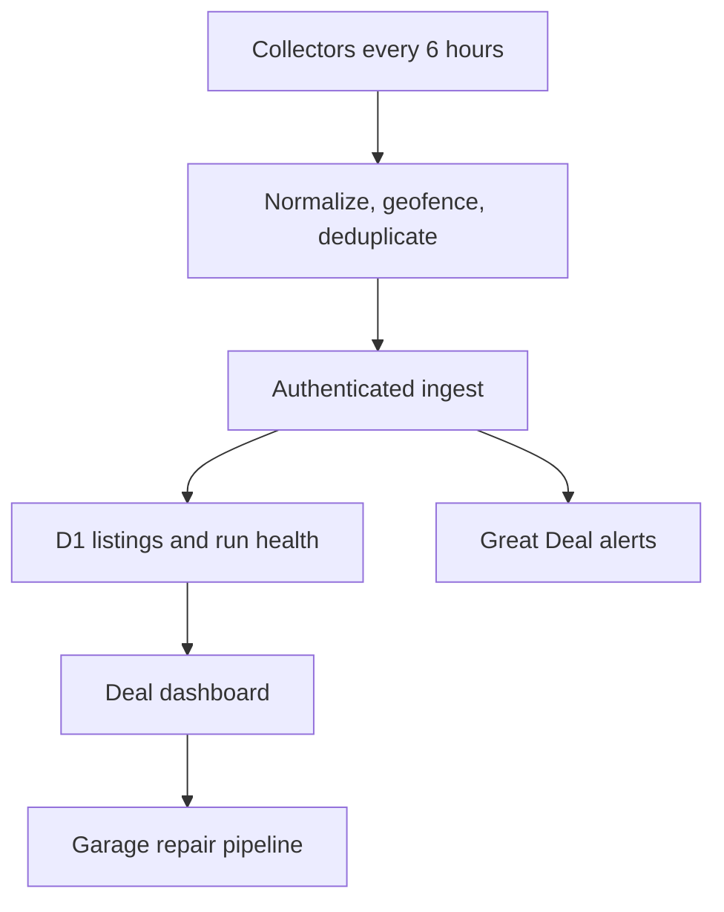

# The Sound Room

The Sound Room is a vintage hi-fi deal finder centered on Udall, Kansas. It
normalizes speaker and receiver listings, rejects equipment outside a 250-mile
radius when coordinates are available, explains repair risk, and tracks finds
from the first look through repair and resale.

The UI uses a warm 1970s catalog and receiver-face design: paper, walnut, brass,
black instrument panels, hard edges, large price and score readouts, and compact
inventory controls. The design rules live in [`DESIGN.md`](DESIGN.md).

## What works

- Responsive dashboard with search, grade/brand/source filters, detail sheets,
  an Udall-centered radius view, and a persistent Garage pipeline.
- Brand aliases for JBL, Klipsch/Klipsh, Advent, Pioneer/Pioner, Sansui,
  Marantz, and Yamaha.
- Explainable Great / Good / Average / No Deal / Bad gauge. Missing price or
  defensible sold comps produces **Needs Review**, never a made-up score.
- Repair-risk reserves, mileage, shipping, and selling fees in the economics.
- Official eBay Browse API collector, compliance-gated Reverb adapter, and an
  authorized JSON bridge for Facebook/estate-sale/manual discoveries.
- Authenticated ingest, source-health history, Pushover Great Deal alerts, and a
  GitHub Actions scan every six hours.
- Labeled demo inventory until the first successful live ingest.

## Local setup

Requires Node.js 22.13 or newer.

```bash
npm ci
cp .env.example .env.local
npm run dev
```

Generate a long random `INGEST_KEY`. Add eBay developer credentials to enable
the official collector. Never commit `.env.local` or marketplace credentials.

```bash
npm run lint
npm test
npm run collect
```

`npm run collect` is a safe dry run when `SOUND_ROOM_INGEST_URL` or
`INGEST_KEY` is missing. Database migrations are under `drizzle/`.

## Scheduled collection

`.github/workflows/collect.yml` runs at minute 17 every sixth hour and can also
be started manually. Configure these GitHub Actions secrets:

- `EBAY_CLIENT_ID`, `EBAY_CLIENT_SECRET`
- `SOUND_ROOM_INGEST_URL`, `INGEST_KEY`
- optionally `PUSHOVER_USER_KEY`, `PUSHOVER_APP_TOKEN`

Facebook credentials are deliberately excluded from GitHub Actions. Follow the
isolated sidecar instructions in [`collectors/facebook/README.md`](collectors/facebook/README.md).

## Architecture



Operational setup and failure recovery are in
[`docs/OPERATIONS.md`](docs/OPERATIONS.md). The deal formula is documented in
[`docs/SCORING.md`](docs/SCORING.md), and source boundaries are in
[`docs/SOURCES.md`](docs/SOURCES.md).

## Important boundary

Scores are triage estimates, not appraisals. Photos, model identity, driver
condition, serial numbers, and an in-person listening test still matter before
buying. The application never bypasses marketplace access controls.
